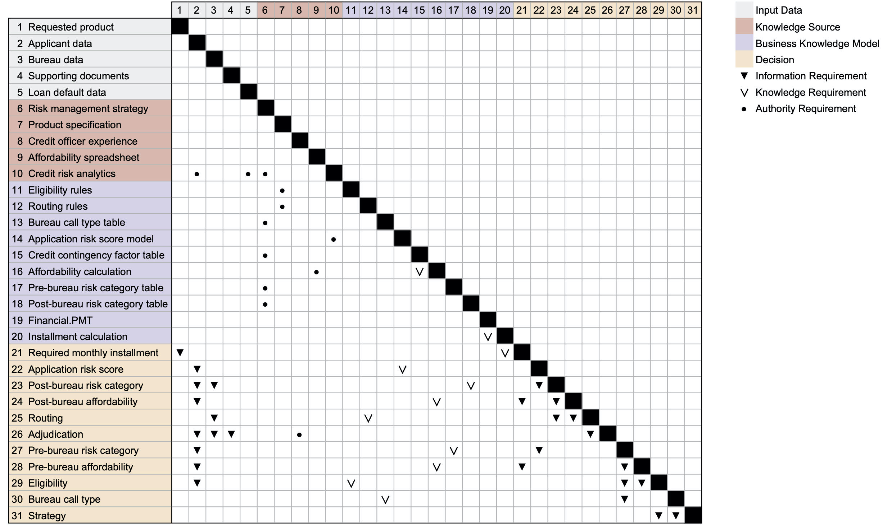

# DSM clustering analysis for DMN models

This repository contains the results of the DSM clustering analysis performed for the paper "Using DSMs for the Visualization and Analysis of Decision Models in Business Processes" accepted for presentation at the [22nd International DSM Conference](https://dsm-conference.org).

## Case study: DSM of Originations

We perform the clustering analysis on the DSM we get for the Originations example of the DMN specification Version 1.3. By applying to the Originations DRG the translation described in the paper we get the following extended binary DSM.

## Likeness clustering analysis

The clustering algorithm described in [(Thebeau, 2001)](https://dsmweborg.files.wordpress.com/2019/05/msc_thebeau.pdf) has 8 parameters. It is possible to let the algorithm ignore specific DSM elements and to define weak and strong interaction in the DSM.

| **Parameter**          | **Short description** | **Value in [(Thebeau, 2001)](https://dsmweborg.files.wordpress.com/2019/05/msc_thebeau.pdf)** |
| --- | --- | --- |
| `pow_cc`           | Penalizes the size of the cluster in the cost calculation | 1 |
| `pow_bid`          | Penalizes large clusters | 1 |
| `pow_dep`          | Emphasize high interactions | 4 |
| `max_cluster_size` | Maximum cluster size | DSM size |
| `rand_accept`      | How often to make an element a member of the highest bidding cluster even if the change do not improve the calculated objective cost | 2 x DSM size |
| `rand_bid`         | How often to accept the bid from the second highest bidder instead of the highest bidder | 2 x DSM size |
| `times`            | Number of times the algorithm will pick a new element before cheking for stability | 2 |
| `stable_limit`     |  Number of times the algorithm must loop through the process without making a change | 2 |

The code for the algorithm, implemented in MatLab, is available at [dsmweb.org](https://dsmweb.org/matlab-macro-for-clustering-dsms/). The algorihtm produces many small clusters (e.g., 16 clusters of size 1 to 3) when using the values reported in the [(Thebeau, 2001)](https://dsmweborg.files.wordpress.com/2019/05/msc_thebeau.pdf) for the parameters.

We use the likeness cluster analysis to evaluate the effects of changing parameters and DSM data. The [dsm](dsm) folder contains the MatLab files for the DSM of Originations. The [results](results) folder contains the results of the different experiments listed in the following table. See [(Thebeau, 2001)](https://dsmweborg.files.wordpress.com/2019/05/msc_thebeau.pdf) for details about the likness analysis charts.

| **Experiment** |  **Likeness mean** | **Likeness median** | **# clusters** |
| --- | --- | --- | --- |
| [Penalize small clusters](/results/1-penalize-small-clusters)(1)  | 0.5749 | 0.50706 | 4 - 10 |
| [Emphasize high interactions](/results/2-emphasize-high-interactions) | 0.53431 | 0.5501 | 5 - 9 |
| [Exclude elements with high number of outputs](/results/3-exclude-elements-with-high-number-of-outputs)(1) | 0.6991 | 0.70922 | 6 - 10(2) |
| [Run for a longer time](/results/4-run-for-a-longer-time)(1) | 0.53119 | 0.5511 | 4 - 7 |
| [Exclude elements and more time](/results/5-exclude-elements-and-more-time) | 0.66507 | 0.66454 | 7 - 10(2) |
| [Emphasize high interactions and more time](/results/6-emphasize-high-interactions-and-more-time) | 0.53745 | 0.53321 | 5 - 9 |
| [Varied interaction levels](/results/7-varied-interaction-levels) | 0.60985 | 0.61259 | 8 - 10 |
| [Varied interaction levels and more time](/results/8-varied-interaction-levels-and-more-time) | 0.58831 | 0.61042 | 6 - 8 |
| [Varied interaction levels and emphasize high interactions](/results/9-varied-interaction-levels-and-emphasize-high-interactions) | 0.61692 | 0.6124 | 7 - 11 |
| [Varied interaction levels and exclude elements](/results/10-varied-interaction-levels-and-exclude-elements) | 0.66831 | 0.6682 | 8 - 12(2) |
| [Emphasize high interactions and exclude elements](/results/11-emphasize-high-interactions-and-exclude-elements) | 0.70994 | 0.70361 | 7 - 10 |

(1) Interesting clustered DSMs.

(2) Excluded elements counted as clusters.