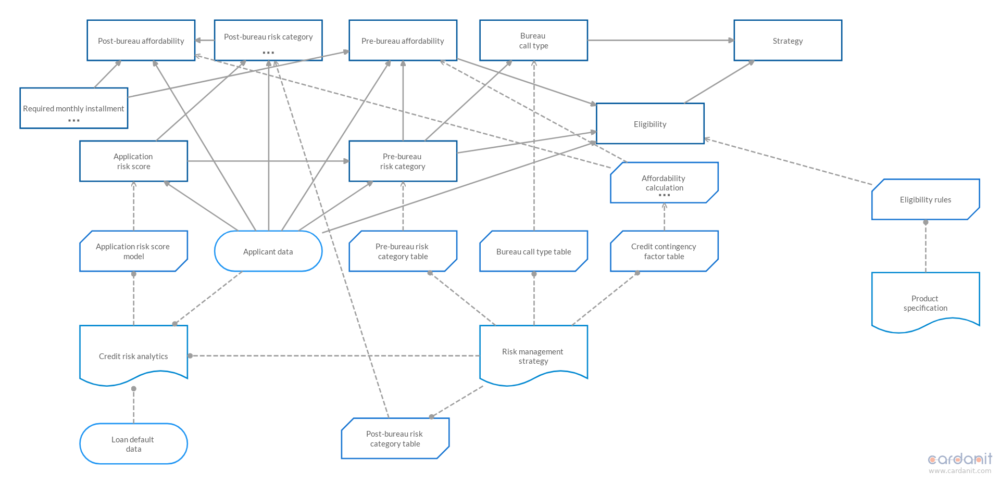
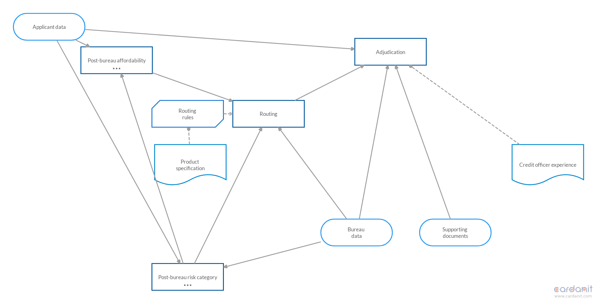
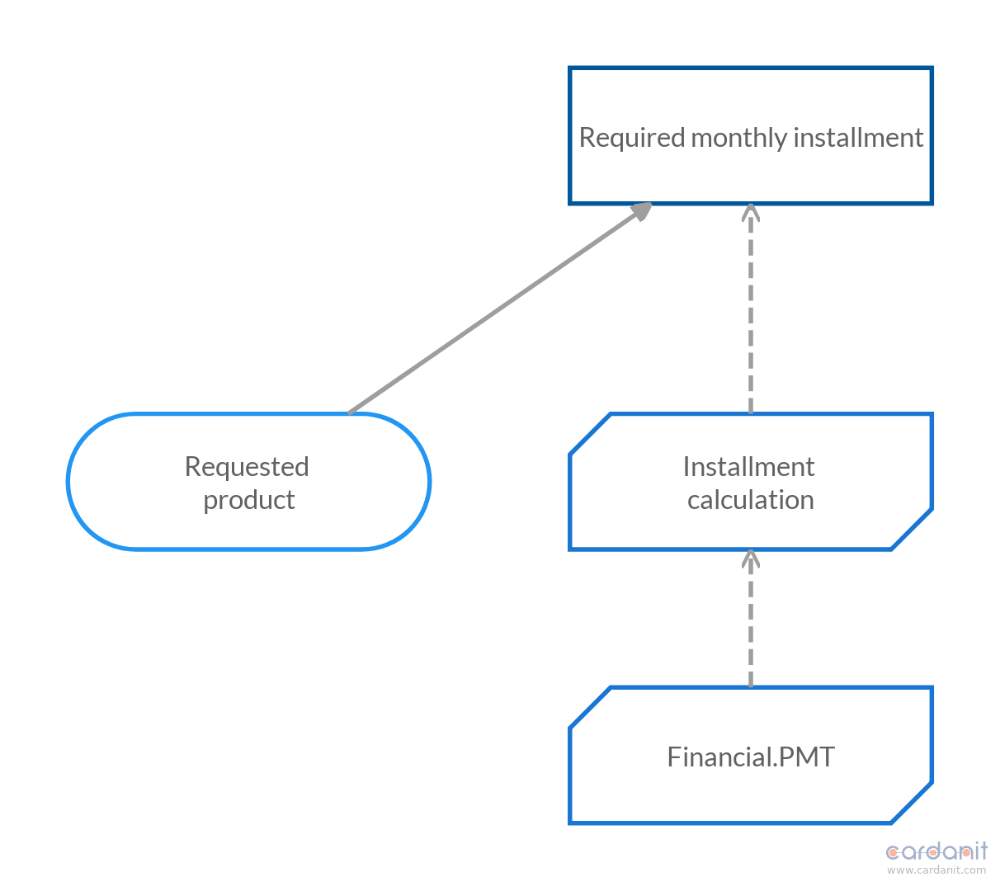
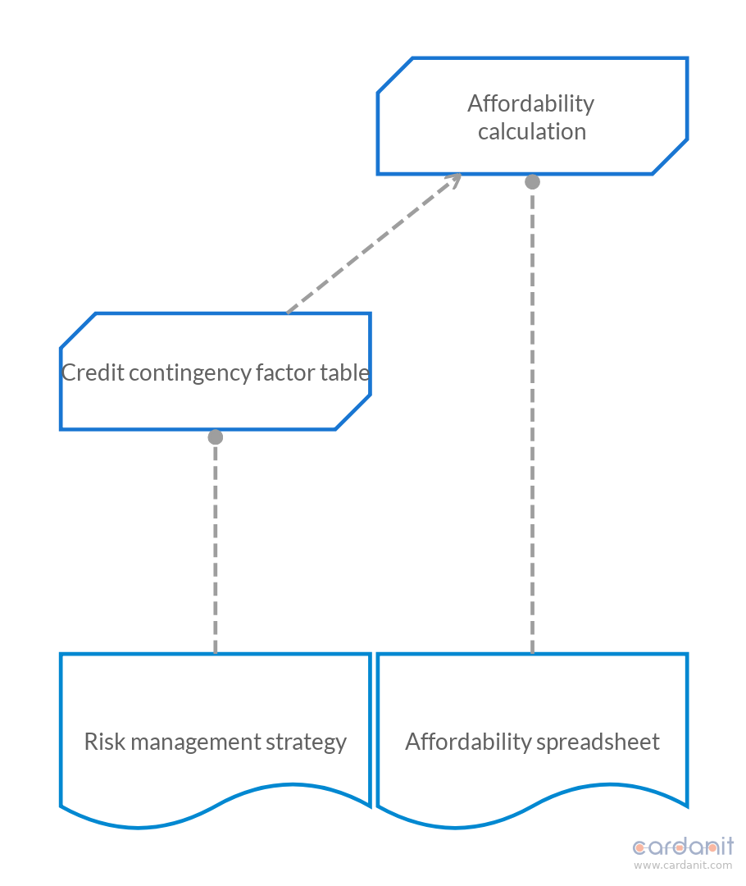

# Penalize small clusters

Clustering algorithm applied to [originations_dsm.m](/dsm/originations_dsm.m).

| **Parameter** | **Value** |
| --- | --- |
| `pow_cc`           |     1 |
| `pow_bid`          |    -1 |
| `pow_dep`          |     4 |
| `max_cluster_size` |    31 |
| `rand_accept`      |    62 |
| `rand_bid`         |    62 |
| `times`            |     2 |
| `stable_limit`     |     2 |

We set `pow_bid` to -1 to penalize small clusters instead of large ones.

| **Mean** | **Median** | **# clusters** |
| -- | -- | -- |
| 0.5749 | 0.50706 | 4 - 10 |

Clusters are not consistent across multiple runs. We get clusterings with too many small clusters, at the same time we get clusterings that are useful to create DRDs. For example, from run number 6 we get the [run-6.dmn](dmn/run-6.dmn) DMN model. The following are the DRDs of the model created with [Cardanit](https://www.cardanit.com).

- DRD from first cluster

- DRD from second cluster

- DRD from third cluster

- DRD from fourth cluster

