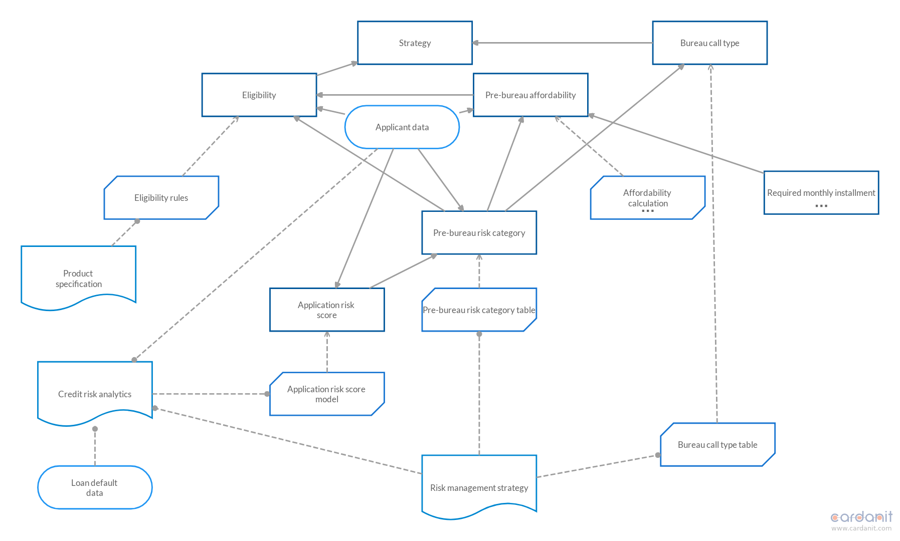
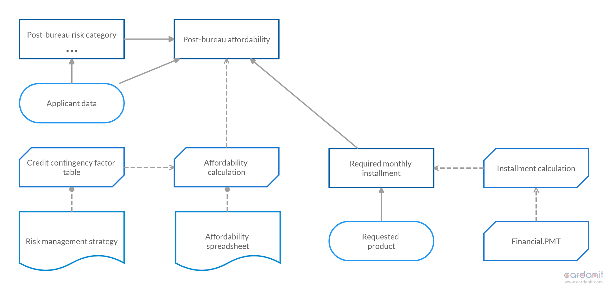
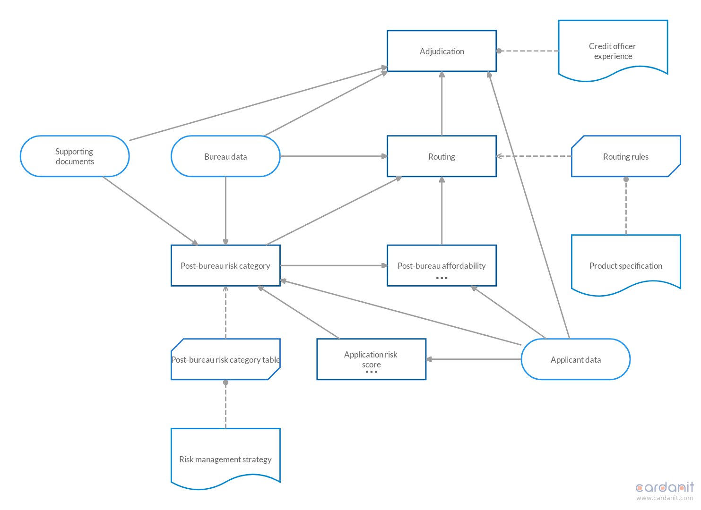

# Exclude elements with high number of outputs

Clustering algorithm applied to [originations_dsm.m](/dsm/originations_dsm.m).

| **Parameter** | **Value** |
| --- | --- |
| `pow_cc`           |     1 |
| `pow_bid`          |    -1 |
| `pow_dep`          |     4 |
| `max_cluster_size` |    31 |
| `rand_accept`      |    62 |
| `rand_bid`         |    62 |
| `times`            |     2 |
| `stable_limit`     |     2 |

We exclude *Applicant data* and *Risk management strategy*. We set `pow_bid` to -1 to penalize small clusters instead of large ones.

| **Mean** | **Median** | **# clusters** |
| --- | --- | --- |
| 0.6991 | 0.70922 | 6 - 10 |

The likeness mean and median is higher. We still get small clusters. *Applicant data* and *Risk management strategy* are counted as clusters, hence the effective number of clusters is 4 - 8.

The clusterd DSM of run 5 is interesting. From it we can get a DMN with three DRDs. The two excluded elements appear in DRDs with elements requiring them. The fourth cluster can be merged with the second cluster. The following are the DRDs created with [Cardanit](https://www.cardanit.com) (see [run-5.dmn](dmn/run-5.dmn) for the DMN model).

- DRD from first cluster

- DRD from second and fourth cluster

- DRD from third cluster
